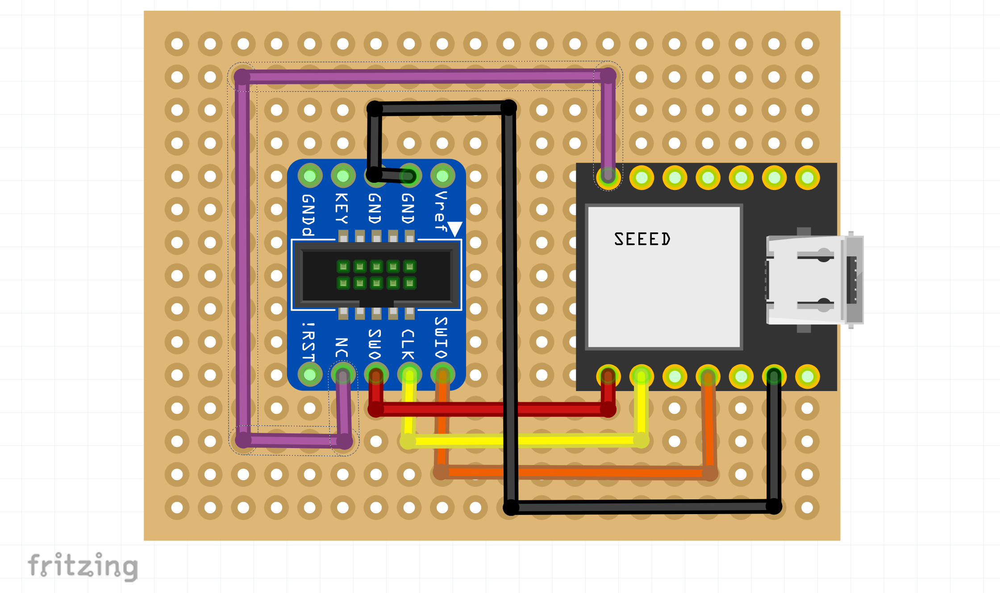

# DelugeProbe

Based on [YAPicoprobe](https://github.com/rgrr/yapicoprobe/), DelugeProbe is a CMSIS-DAP debugger and firmware loader tailored to the hardware of the Synthstrom Audible Deluge's Renesas RZ/A1LU (R7S721020) processor. It has been released in anticipation of the June 5, 2023 opening of the Synthstrom Deluge source code as an acceptable substitute for the very expensive ($500-1500 USD) SEGGER JLink debugger.

While YAPicoprobe is very full-featured, many of those features have been disabled or reworked in DelugeProbe. While the Sigrok code is still present, it has been disabled in release versions for user simplicity and safety of the hardware as the dev boards used do not have logic/line level shifters. If this is a feature you want, feel free to download the source and re-enable it to compile your own version.

## Features

* Processor support for the Renesas RZ/A1LU (used by the Synthstrom Deluge as well as the Renesas GR-LYCHEE development board) ARM Cortex A9 processor
* As a CMSIS-DAP device, it works perfectly in OpenOCD with Renesas e2 Studio (Eclipse), the official (Windows-based) IDE for RZ/A1LU development. The Synthstrom Deluge community repository will include the appropriate Debugger .launch files out-of-the-box.
* Support for debugging in Visual Studio Code using the Cortex-Debug extension. Detail to come...
* Support for running this firmware on various RP2040 devices to ensure you can tailor your debugger to your needs! So far we support:
    * Raspberry Pi Pico
    * Raspberry Pi Pico W
    * Raspberry Pi Pico Debug Probe
    * Seeed XIAO RP2040
    * Adafruit QT Py RP2040
    * and growing...
* Of course, as with the original Picoprobe, the DelugeProbe can be used to debug ARM Cortex M-series devices including the RP2040 itself!

## Wiring

Using an SWD breakout board from Adafruit, here are some Fritzing images showing the default wiring for some of the supported devices:

### Raspberry Pi Pico and Pico W

### Seeed XIAO RP2040

